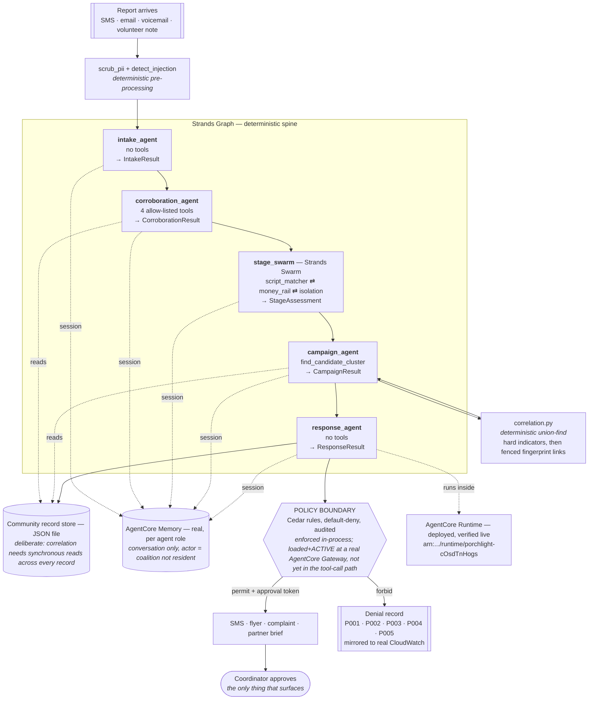

# Porchlight

> **One person sees one incident. Porchlight sees the campaign.**

A community-operated agent for the small teams that respond to fraud against
older adults. It takes the repetitive intake work off a part-time coordinator —
and because it then sees every report at once, it catches the thing no single
person can: the scam campaign sweeping a neighbourhood, while there are still
people it hasn't reached.

Built with the [Strands Agents SDK](https://strandsagents.com) for the AWS
*Agents for Humans* hackathon, **Good Neighbor Agents** track.

```
Attribution F1 1.00 across 5 seeds · 0 false links · 200 tests · Apache-2.0
```

Every number in this README is either measured by a command you can run, or
cited to a source. The ones that are neither were removed; see
[Claims and evidence](#claims-and-evidence).

---

## The problem

Modern scams against older adults are not messages. They are multi-day,
multi-actor campaigns — a pop-up hands the resident to a fake bank desk, which
hands them to a fake police officer, ending in an instruction to move money by a
rail chosen for how hard it is to reverse.

Two things follow:

1. **No message-level filter can see this.** Each artefact is unremarkable
   alone; the campaign only exists across time and across people.
2. **The data that would reveal it is never assembled.** Every neighbourhood
   being worked by a crew is generating exactly the signal that would expose it —
   and losing it, one report at a time, in separate inboxes.

Scale, for context (external sources, not our measurements): US adults aged 60+
reported **$2.4B** in fraud losses to the FTC in 2024, and the FTC's own modelling
puts the true figure between **$10.1B and $81.5B** once under-reporting is
accounted for.[^ftc]

## Who it is for

Not "seniors" — that would be a personal assistant. The user is the **local
elder-fraud prevention and response network**: the CFPB-documented grouping of
adult protective services, police, prosecutors, legal aid, a partner bank and an
area agency on aging, coordinated by one part-time volunteer. The CFPB reports
that *hundreds of counties* have built one.[^cfpb]

Their core work — intake, corroboration, cross-agency notification, community
education — is precisely the repetitive, judgment-heavy load this hackathon asks
you to lift off a human.

## Why existing approaches miss it

| Approach | What it sees | Why it misses the campaign |
|---|---|---|
| Spam / phishing filters | one message | Judges each artefact in isolation. A campaign is a property of the set. |
| Fraud analytics at a bank | one institution's transactions | Sees the money, not the script, and only its own customers. |
| A shared inbox or spreadsheet | everything, unstructured | Correlation is a human reading 60 free-text reports and remembering. That is the job being lost. |
| A chatbot over the reports | whatever it is asked | Answers questions. Nobody thinks to ask "are reports 7, 19 and 44 the same crew?" |

Porchlight's unit of detection is the **community**, so its unit of memory is the
community too.

## What it does

Porchlight works the queue while nobody is watching, and interrupts once.

Reports arrive by webhook. Unattended, it deduplicates repeat calls from the same
resident, extracts indicators, runs allow-listed corroboration tools, merges
follow-ups into existing cases, and correlates across people. When reports from
*different* residents turn out to share a crew, it drafts a community warning and
stops.

The coordinator opens the inbox and sees three things, in this order:

```
  Since you last looked, Porchlight worked through 47 reports,
  folded in 6 repeats and spotted 1 campaign.

  NEEDS YOU  ── 1 ────────────────────────────────────────────
  Warn the 411038 list — crew running 'parcel seized customs bribe'
  Why now: 3 reports from 3 residents in 4 days, sharing
     same callback number   +91 90000 00093
     same payment handle    payee042@ybl
  [ the warning, already written ]
  Approve and send   ·   Save wording   ·   Not now

  WHO TO CALL FIRST ──────────────────────────────────────────
  BLACK   now   resident-204   money already moved
  RED     2h    resident-101   payment instructed, not yet sent
  AMBER   24h   resident-118   contacted, no payment discussed
```

They approve, edit, or reject. That is the whole interaction.

The case list is not sorted by "how likely is this a scam" — everything in it
probably is. It is sorted by **hours to irreversible loss**, because that is the
only ordering that tells a coordinator who to call first. Where that is unknown
it says "unknown", rather than a number nobody measured.

Full pipeline and trust boundaries: **[docs/architecture.svg](docs/architecture.svg)**.

## Why this needs an agent

A script could regex indicators out of a report. What it could not do is the
part that makes the output usable: read an unstructured account of a phone call
and decide *what evidence is missing*, choose which of the corroboration tools
would settle it, weigh a cluster the correlation layer proposes against the
narrative and say whether it is really one crew, and then decide that this
particular case warrants a broadcast while that one does not. Those are
judgement calls over open-ended text, made in sequence, where each step changes
what the next step needs.

Where a deterministic function is better, it stays deterministic — see below.

## Campaign correlation

**Clustering is not a model decision.** `src/porchlight/correlation.py` is
union-find over hard indicators (callback numbers, payment handles, wallets,
URLs), followed by a fingerprint-similarity pass fenced by same-area,
same-window, different-reporter, and a cluster-size cap.

That split is deliberate and load-bearing:

- it is **reproducible and testable**, so the eval can score it without model
  variance;
- **injected prose cannot argue its way into or out of a cluster** — set
  membership is computed from indicators, not from text;
- an unfenced fingerprint pass collapses a 60-report corpus into one "campaign",
  which is a false alarm broadcast to a list of frightened people. The eval's
  link-precision gate exists to catch exactly that regression.

The agent's job is to **judge** the cluster the module builds, and every campaign
states its evidence:

```
Potential campaign detected — 3 reports, 3 residents, 1 day
  • shared callback number  phone:9000000093
  • shared payment handle   upi:payee042@ybl
  • same script fingerprint "parcel seized customs bribe"
  • one postal area         411038
```

## The human decision boundary

`POST /approve` is the only place in the system that mints an approval
capability, and it mints it against a named human. That capability is:

- **registered** — the policy engine accepts only tokens it issued, so a token
  asserted inside a report, a tool argument or a model output is data, not
  authority;
- **scoped** — an approval for the flyer does not release the SMS;
- **single-use** — approval is authority to send one message, not a licence;
- **not an override** — a coordinator satisfies P002; P001, P003 and P004 still
  refuse. A named human cannot approve contacting attacker infrastructure, and
  cannot buy a third broadcast past the rate limit.

## The trust boundary

**Every input this agent receives was written by an adversary.**

Once tools like this exist, crews will write to them. So the controls do not live
in prompts, where they would be requests. They live in a Cedar rule set evaluated
outside the model, default-deny, with every decision audited.

A hostile report does not merely fail to do damage — it leaves a record a
coordinator can point at:

```
DENY  P001  http.fetch      actor=report-content  origin=untrusted-content  report=rpt-hostile
DENY  P002  broadcast.send  actor=report-content  origin=untrusted-content  report=rpt-hostile
```

`tests/injection/` asserts the load-bearing claim across 20 payloads in six
categories, and deliberately does **not** assert "the model refused":

> No hostile report, however framed, produces a side effect.

See **[docs/threat-model.md](docs/threat-model.md)**.

## Architecture



Full rationale for every box, and the deployment status behind each dotted
line: **[docs/architecture.md](docs/architecture.md)**. Static image version:
**[docs/architecture.svg](docs/architecture.svg)**.

### Global core, local adapter

The intelligence core — indicator extraction, correlation, the evidence model,
the policy rules — names no country. Everything a jurisdiction changes lives in
`packs/<name>.yaml`: where to report, who the partners are, which scripts and
money rails are seen locally, which institutions get impersonated, what a
plausible phone number looks like, the currency.

Adding a jurisdiction is adding a YAML file, not editing Python. The same report,
under two packs:

```
pack=India          script=electricity bill disconnection tonight   rail=upi   currency=INR
pack=United States  script=utility or service cutoff threat         rail=none  currency=-
```

Two packs ship (`in`, `us`). That is a demonstration of the mechanism, not a
claim of global coverage.

## Measured evaluation

`python tasks.py eval` — 60 synthetic reports, offline deterministic mode.
`python tasks.py seeds` runs the whole thing across five corpus seeds; the
figures below are the **worst** seed, not the mean, because a coordinator is not
comforted by the average day.

| Metric | Across 5 seeds | What it means |
|---|---|---|
| Campaign attribution — **F1** | **1.00** on every seed | The planted campaign, recovered exactly |
| Link precision | **1.00** on every seed | Of every pair of reports asserted to share a crew, none was wrong |
| False-positive links | **0**, total, across all seeds | No unrelated residents merged into a campaign |
| Link recall | 0.82 | Some genuine same-crew pairs are not linked — the deliberate cost of the corroboration rule below |
| Challenge cases passed | 4 of 4, every seed | Shared legitimate infrastructure, bridging report, out-of-window, ambiguous urgency |
| Injection flagging — held out | **0.14–0.57, median 0.29** | Paraphrase, homoglyph, spacing, base64, non-English evasions |
| Injection flagging — in vocabulary | 1.00 | Regression check only — see caveat below |

### The challenge set is where the real work showed up

Adding four adversarial cases to the corpus dropped link precision from 1.00 to
**0.50** and produced **21 false-positive links**. The cause was a single rule
that had looked fine for months: two reports sharing *one* hard indicator were
treated as the same crew. Several unrelated scams all tell the victim "ring your
bank on the number on your card", so every one of those reports carried the same
real helpline — and union-find fused them into one fictitious campaign, the kind
that gets broadcast to a list of frightened people.

A link now needs either **two independent shared indicators**, or **one shared
indicator plus the same script**. A crew working a neighbourhood clears that
without trying; a bank's helpline does not. Precision went back to 1.00 with zero
false-positive links, and link recall fell to 0.82. That trade is the right way
round: a false campaign costs the coalition its credibility, and credibility is
the thing it cannot rebuild.

### Two caveats stated rather than buried

- **In-vocabulary injection recall is not a capability measurement.** Those
  payloads and the detector's signature list were written against each other. It
  is a regression test. The honest number is the held-out one — **median 0.29,
  as low as 0.14 on one seed** — and it is low because a signature list catches
  the careless and misses the deliberate. That is survivable *because the
  detector is not the control*: P001–P005 gate the action, not the prose. A
  missed flag costs a badge on a screen; it does not cost a broadcast.
- **There is no time-saving claim.** An earlier version of the eval divided an
  unmeasured 18-minute "manual baseline" by the offline stub's own latency and
  reported a ~254,000× speedup. Both halves were unsupported and both are gone.
  [docs/manual-baseline.md](docs/manual-baseline.md) sets out how to measure one
  properly; until someone runs it, no comparison is reported.

The eval exits non-zero below attribution F1 0.80, below link precision 0.90, or
if any challenge case regresses — on any of the five seeds. A clustering
regression breaks CI rather than the demo.

## Demo

```bash
make run                 # dashboard on :8080
```

1. **Load prior reports.** 54 of the 60 land in the community store; 6 are held
   back. **Zero campaigns are visible** — not just the planted one. An earlier
   version held back only the headline crew, which left a second, honestly-
   earned near-miss campaign already on screen; the corpus's own ground truth
   now drives the hold-back, so every crew sits one report short and the
   screen does not open on any answer.
2. **Send one of the held-back reports to `POST /reports`** — the same webhook
   a partner system would use; the dashboard has no manual-entry composer,
   deliberately, since reports arrive from partner systems, not from someone
   typing into the coordinator's own screen. The campaign fires: campaign
   count goes 0 → 1, the case comes back `newly_escalated: true`, and the
   panel states the shared indicators that link it.
3. **Open the case.** "How this report was assessed" lists every pipeline node
   — intake, corroboration, stage, correlation, response — and marks each one
   `agent` or `rule`. Correlation is always `rule`, in every mode: it is a
   deterministic module the agents judge the output of, never something the
   model is asked to decide. The other four are real Strands agents in live
   mode and rule-based stand-ins offline, and the panel says which, honestly,
   for the run you are looking at.
4. **Send a hostile report the same way.** It is processed as a real report —
   the scam underneath is not lost — and the policy trail records what it
   asked for and that it was refused, tagged to its report id.

`docs/demo-script.md` has the five minutes beat by beat. Steps 1, 2 and 4 are
asserted end to end by `tests/test_server.py::test_the_hero_scenario`; step 3
is checked separately by `tests/test_server.py::test_case_detail_carries_the_pipeline_trace_per_report`
and `tests/test_trace_and_tools.py`. The demo is a regression test rather than
a rehearsal, not a slideshow rehearsing something that might drift.

## Setup

```bash
pip install -r requirements-dev.txt && pip install -e .
cp .env.example .env            # PORCHLIGHT_OFFLINE=1 needs no AWS account

make corpus                     # 60 reports, one planted campaign
make demo                       # watch the campaign fire, in the terminal
make run                        # the coordinator dashboard on :8080
make eval                       # the table above, reproducible
python tasks.py check           # lint, tests, corpus, eval, 5-seed gate
```

`make run` also serves the AgentCore Runtime contract (`POST /invocations`,
`GET /ping`) from the same process, so `deploy/` ships this file unmodified.

Live mode: set `PORCHLIGHT_OFFLINE=0` and configure `AWS_REGION`.

## Deployment status

Stated precisely, because "built on AgentCore" is easy to imply and hard to
withdraw.

| Component | Status | Evidence |
|---|---|---|
| Container image | **Verified** | `linux/arm64`, non-root, port 8080. Built and run: `/ping` → `Healthy`, `/healthz` shows the worker running, `/replay` holds back 6 reports and reports 0 campaigns, `/invocations` returns a triaged case, `/` serves the inbox |
| AgentCore Runtime contract | **Verified** | `GET /ping` + `POST /invocations` served and tested (`tests/test_server.py`) |
| AgentCore Policy engine | **Verified** | Engine created in a real account and reached `ACTIVE`; `deploy/setup_policy.sh` is idempotent against it |
| Cedar accepted by AgentCore | **Verified** | `CreatePolicy` accepts `definition.cedar.statement` with `enforcementMode` `ACTIVE`/`LOG_ONLY` |
| Porchlight's 5 rules enforced at a Gateway | **Loaded and ACTIVE at a real Gateway; not yet in the tool-call path** | `PorchlightGateway` exists (`READY`), the policy engine is attached to it in `ENFORCE` mode, and `list-policies` confirms all 5 rules reached `ACTIVE` against that gateway's real ARN. The running app does not yet call this gateway — see below. |
| CloudWatch denial records | **Verified** | `PORCHLIGHT_CLOUDWATCH_LOG_GROUP` mirrors every policy decision to a real log group; a planted denial was fetched back with `aws logs get-log-events` |
| AgentCore Memory backing agent conversation | **Verified** | Every agent role gets a real AgentCore Memory session (`PorchlightCommunityMemory-csMZJnAAJD`, `ACTIVE`); a live call was made and `list_events` independently confirmed the turn persisted. The structured record store correlation reads remains a JSON file, by design — see Limitations |
| Deployed to AgentCore Runtime | **Verified live** | `arn:aws:bedrock-agentcore:us-west-2:899427357316:runtime/porchlight-cOsdTnHogs`, status READY. `agentcore invoke` against the real endpoint returned a correctly triaged case (urgency=red, script extracted) running live on Nova Pro inside the deployed ARM64 container |
| Live model mode (Bedrock) | **Verified — full five-node run, zero errors** | Anthropic's model is blocked account-wide by `AccessDeniedException: INVALID_PAYMENT_INSTRUMENT` (an AWS Marketplace billing subscription issue, confirmed external — see below). With `PORCHLIGHT_MODEL_ID=us.amazon.nova-pro-v1:0` and nothing else changed, intake → corroboration → stage swarm → correlation → response completed live end to end: 5 drafts produced, 1 correctly held at the policy boundary pending approval. Same architecture, same policy layer, different Bedrock model — see below. |

**The gateway row, precisely.** AgentCore Policy rejects a Cedar policy whose
resource scope is a wildcard, requires `resource == AgentCore::Gateway::"<arn>"`
for any policy that constrains the action, and — a third wall, hit only once a
gateway existed — rejects an action nobody registered: Cedar validation fails
with `unrecognized action ... did you mean "UnknownTool"?` until a gateway
*target* actually declares that tool name. `PorchlightGateway` now exists with a
target (`PorchlightTools`, backed by a stub Lambda — see
`policies/README.md`) that declares all 15 tool names the Cedar files reference,
and all 5 policies load and read back as `ACTIVE`, not merely `CreatePolicy`
returning 200. What this does **not** mean: the running server still enforces
every decision through `src/porchlight/policy.py`, in-process — nothing in the
tool layer calls the Gateway's MCP endpoint yet, so the stub Lambda backing
`PorchlightTools` has never been invoked by a live report. The rules are real
and active at a real boundary; routing this app's actual tool calls through
that boundary is separate work, not done. `policies/README.md` has the full
detail and the exact commands used to verify each claim.

Whichever backend is actually deciding, `src/porchlight/policy.py` is what the
running server calls, and the dashboard's badge — **"local Cedar-equivalent
shim"** or **"AgentCore Policy (gateway)"**, depending on whether
`AGENTCORE_POLICY_ENGINE_ID` is set — always names which one, next to the audit
log. `tests/test_policy_parity.py` asserts the two implementations agree on the
action set and on what P002 demands — not merely on policy ids.

**The live-model row, precisely.** Amazon Nova Pro and Meta Llama 3.3 were
tested directly against this account's Bedrock endpoint (`converse`) and both
succeeded on the first call — the `INVALID_PAYMENT_INSTRUMENT` block is
specific to completing Anthropic's AWS Marketplace listing, not a restriction
on the account's Bedrock access generally. Switching only
`PORCHLIGHT_MODEL_ID` to `us.amazon.nova-pro-v1:0` and running the same
`process_report()` pipeline with `PORCHLIGHT_OFFLINE=0` surfaced three real
things, two of them latent bugs no test had ever reached:

1. A Nova structured-output call sometimes emits `null` for an empty list where
   Claude emits `[]`. Fixed at the model layer (`src/porchlight/models.py`,
   `_NoneListsToEmpty`) rather than papered over per call site.
2. `pipeline._extract_structured()` read `swarm_result.execution_order`, which
   does not exist on `strands-agents` 1.55.0's `SwarmResult` — the field is
   `node_history`, and the parsed model lives at
   `results[node_id].result.structured_output`, not on the `NodeResult`
   directly. Offline mode never calls this function at all (`_run_offline` sets
   `case.stage` directly), so this was wrong behind 200 green tests until a
   live run finally reached it.
3. The stage swarm's last speaker sometimes ends its turn on plain text instead
   of the structured tool call. Fixed with the same two-phase pattern already
   used for the corroboration node: ask that agent directly for the schema over
   its own finished conversation, rather than re-running the swarm.

With those three fixes, `intake → corroboration → stage → correlation →
response` completed live, end to end, with `case.errors == []`: 5 drafts, 1
correctly gated at the policy boundary pending a coordinator's approval. The
Devpost rules for this hackathon name the Strands Agents SDK as the
requirement, not a specific model vendor — Bedrock AgentCore is called out as
strengthening the score, not mandatory — so running live against a different
Bedrock model is a legitimate substitution, not a rules workaround. Anthropic's
model remains the intended default in `.env.example`; switching back is a
one-line change once the Marketplace subscription clears.

## Limitations

- **The structured record store is a JSON file, deliberately, not a gap.**
  Campaign correlation needs synchronous reads across every record in a
  community — a different access pattern from a conversational memory API — so
  it is not backed by AgentCore Memory and there is no plan to change that. In
  a container without a volume, this store does not survive a restart.
- **Agent conversation memory is backed by AgentCore Memory**, per role, per
  community (`src/porchlight/memory.py`, `agents/factory.py`). This is turns,
  not records: what an agent remembers about how it has reasoned before, not
  the case data correlation depends on.
- **The policy boundary is in-process today**, which means it is outside the
  model but inside the same trust boundary as the agent. The five rules are
  loaded and `ACTIVE` at a real AgentCore Gateway (see Deployment status), but
  the running app does not call it — moving enforcement itself to the gateway
  is the difference between a strong control and an enforced one.
- **`detect_injection` is signature-based** and misses 4 of 7 held-out evasions.
  It is a finding-generator, not a control.
- **The corpus is synthetic.** Detection rates on it are a floor, not a field
  measurement.
- **No IdP in front of the API.** By default `POST /approve` records *which*
  human approved; it does not verify *that* they are that human. Setting
  `PORCHLIGHT_COORDINATOR_CREDENTIALS` closes the sharpest edge of that gap —
  approving then requires the shared secret registered to that exact name, so
  an unauthenticated caller or a name lifted from report content cannot mint a
  capability — but it is still a shared secret, not a real identity provider:
  no session, no rotation, no revocation list. Real deployment needs an IdP in
  front of it.
- **Two jurisdiction packs**, both written by one person from public sources, and
  neither reviewed by a practitioner in that jurisdiction.
- **Single-process state.** The audit trail and rate-limit window are module
  globals, not per-tenant storage.

## Future work

In the order that would matter most:

1. Build the AgentCore Gateway, load the five Cedar policies against it, and move
   enforcement out of the process — then replace the "Not verified" rows above.
2. Back the record store with AgentCore Memory so community memory survives a
   restart.
3. Put an IdP in front of `/approve` so the approver is authenticated, not just
   named.
4. Run the manual-baseline study in `docs/manual-baseline.md` with real
   coordinators, and report time *and* accuracy.
5. Have a practitioner in each jurisdiction review its pack before it is used.

## Claims and evidence

| Claim | Classification | Evidence |
|---|---|---|
| $2.4B reported 60+ fraud losses, 2024; $10.1B–$81.5B modelled | Externally verified | FTC annual report to Congress[^ftc] |
| Hundreds of US counties run an elder-fraud network | Externally verified | CFPB[^cfpb] |
| Attribution F1 1.00, link precision 1.00, 0 false links | Measured | `python tasks.py seeds`, 5 seeds |
| Held-out injection recall 0.14-0.57 (median 0.29) | Measured | `python tasks.py seeds` |
| 200 tests, lint clean | Measured | `python tasks.py check` |
| AgentCore Policy engine created and ACTIVE | Measured (live AWS) | `deploy/setup_policy.sh --apply` |
| Container serves the Runtime contract | Measured | built and curled locally |
| The corpus, its scripts and all identifiers | Synthetic / reconstructed | `corpus/templates.yaml` |
| Time saved vs. a manual baseline | **Removed — unsupported** | see [docs/manual-baseline.md](docs/manual-baseline.md) |
| "Every other agent assumes benign input" | **Removed — unverifiable** | competitive claim about submissions nobody has surveyed |

## Data provenance

No real victim data is used anywhere. The corpus is **reconstructed** from
publicly documented scam patterns. Domains use the reserved `.example` TLD
(RFC 2606). Phone numbers, payment handles and wallet addresses are invented
placeholders held constant for reproducibility — they are *not* drawn from a
regulator's documentation range, because no such range exists for those
identifier types in the jurisdictions modelled. Do not dial or pay them.
See `corpus/templates.yaml`.

## Documentation

| Doc | What is in it |
|---|---|
| [docs/architecture.md](docs/architecture.md) | Node graph, why each node exists, what is deliberately not a model decision |
| [docs/threat-model.md](docs/threat-model.md) | Assets, adversaries, attack classes and their controls, known limits |
| [docs/architecture.svg](docs/architecture.svg) | The diagram: pipeline, trust boundary, human boundary, and what is not deployed |
| [docs/demo-script.md](docs/demo-script.md) | The 3-minute and 5-minute cuts, beat by beat |
| [docs/submission-copy.md](docs/submission-copy.md) | Devpost text, with an honest-status section |
| [docs/CLAW-BACK.md](docs/CLAW-BACK.md) | Submission checklist, blockers, and what only a human can do |
| [SUBMISSION-PREEXISTING.md](SUBMISSION-PREEXISTING.md) | Pre-existing work disclosure |
| [docs/manual-baseline.md](docs/manual-baseline.md) | Why there is no time-saving claim, and how to earn one |
| [docs/prompts.md](docs/prompts.md) | Every system prompt in full, generated from the source modules |
| [policies/README.md](policies/README.md) | The Cedar rules, and what AgentCore does and does not accept |

## Licence

Apache-2.0. See [LICENSE](LICENSE).

[^ftc]: Federal Trade Commission, annual report to Congress on protecting older
    consumers (2024 data): <https://www.ftc.gov/news-events/news/press-releases/2025/12/ftc-issues-annual-report-congress-agencys-actions-protect-older-adults>
[^cfpb]: Consumer Financial Protection Bureau, "Report Finds Hundreds of Counties
    Nationwide Fighting Elder Financial Abuse with Community Efforts":
    <https://www.consumerfinance.gov/about-us/newsroom/consumer-financial-protection-bureau-report-finds-hundreds-counties-nationwide-fighting-elder-financial-abuse-community-efforts/>
