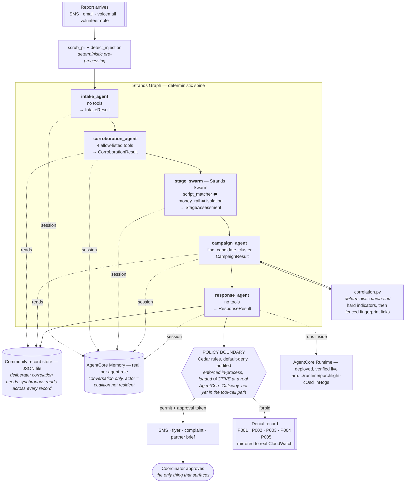

# Architecture

## The shape of the problem

A scam that empties an older person's savings is not a message. It is a
multi-day, multi-channel, multi-actor campaign: a pop-up hands the resident to a
fake bank desk, which hands them to a fake police officer, which ends in an
instruction to move money by a rail chosen for how hard it is to reverse.

Two consequences drive every design decision here:

1. **No message-level filter can see it.** Each artefact is unremarkable alone.
   The campaign only exists across time and across people.
2. **The unit of detection is the community, not the individual.** So the unit of
   memory is the community too.

## Node graph



## Why each node exists

| Node | Tools | Why it is separate |
|---|---|---|
| `intake_agent` | **none** | It is the only node that reads attacker-authored text, so it is given zero capability. An injection that lands here has nothing to reach for. |
| `corroboration_agent` | 4, allow-listed | Checking indicators is the one place outbound calls happen. Confining them to one node makes the capability surface auditable in a single `tools=` list. |
| `stage_swarm` | none | Three assessors that disagree productively. One agent asked to do all three collapses into "scam, severity high", which is useless for triage. |
| `campaign_agent` | `find_candidate_cluster` | It *judges* a cluster; it does not build one. Clustering is deterministic so it is testable and so injected prose cannot argue its way into a cluster. |
| `response_agent` | **none** | It drafts. It has no send tool, so "send this now" is not a capability it can be talked into. |

## The two things that are deliberately not model decisions

**Clustering** (`src/porchlight/correlation.py`) is union-find over hard
indicators, with fingerprint-similarity links fenced by same-area, same-window,
different-reporter and a cluster-size cap. This is not conservatism for its own
sake: an unfenced fingerprint pass collapses a 60-report corpus into one
"campaign", which would be a false alarm broadcast to a list of frightened
people. The eval harness catches exactly that regression.

**Authorisation** (`src/porchlight/policy.py` + `policies/cedar/`) is a Cedar
rule set evaluated outside the model, default-deny, with every decision audited
and attributed. Today it runs in-process; the intended home is AgentCore Policy
at a Gateway, which is outside the *process* as well. A control in a system
prompt is a request; a control in this layer is a rule that holds even when the
model has been persuaded otherwise. Moving it to the gateway upgrades it from
"outside the model" to "outside the blast radius" — see the deployment table.

## Data flow, and what is never stored

```
raw artefact ──► scrub_pii ──► envelope ──► model (data channel only)
                    │
                    └──► card numbers, government IDs, OTPs are removed here
                         and never reach memory, a case file or a partner brief

community store record  =  {report_id, pseudonym, coarse area (pincode/ZIP),
                            timestamp, script_fingerprint, indicator_keys,
                            money_rail, urgency, campaign_id}
```

There is no resident profile in this system. The memory actor id is
`coalition::<community_id>` — the coalition is the actor, residents never are.
That is a deliberate structural choice: it means the long-term memory cannot
become a dossier on any individual, and it is why this is a Good Neighbor agent
rather than a personal assistant with extra steps.

## Deployment

This table is the *intended* deployment, with each row's real status attached.
An architecture diagram that lists services the code does not reach is a wish
list, and a judge who checks one row and finds it aspirational stops trusting the
other five.

| Layer | Service | Status today |
|---|---|---|
| Agent runtime | AgentCore Runtime | **Deployed and verified live** — `arn:aws:bedrock-agentcore:us-west-2:899427357316:runtime/porchlight-cOsdTnHogs`, status READY, a real `agentcore invoke` returned a correctly triaged case |
| Container | linux/arm64, :8080, non-root | **Verified** — built and run both locally and as the deployed image; `/ping` and `/invocations` answer |
| Authorisation | AgentCore Policy (Cedar, default-deny) | Engine **ACTIVE**, a real Gateway **READY** with the engine attached in `ENFORCE` mode, all 5 rules **loaded and ACTIVE** against it. Tool calls do not yet route through it — see `policies/README.md` |
| Tool boundary | AgentCore Gateway | **Built** — `PorchlightGateway`, READY, with a `PorchlightTools` target declaring the 15 tool actions the Cedar rules reference |
| Long-term memory | AgentCore Memory | **Wired for agent conversation** — every agent role gets a real session, verified via `list_events`. The structured record store correlation reads stays a JSON file, deliberately (different access pattern) |
| Tracing | AgentCore Observability (OTEL) | Enabled on the deployed Runtime; X-Ray trace destination configured (10-15 min propagation delay noted by the toolkit) |

The README's deployment table carries the full detail, including why a Cedar
policy that constrains an action must name a specific gateway.

`PORCHLIGHT_OFFLINE=1` runs the identical clustering and policy logic against
deterministic node implementations — no AWS, no cost, no model variance. That is
what CI and the test suite use. It is a development mode, not a fallback: the
demo runs on Bedrock.
